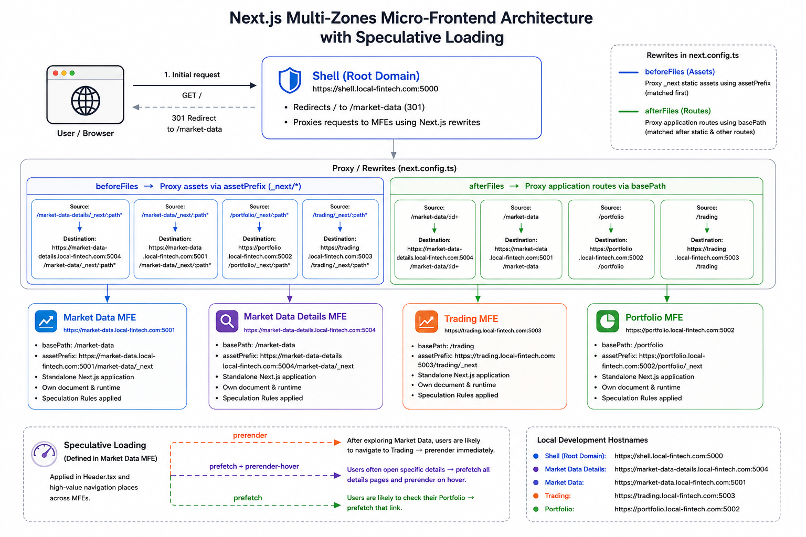

# Next.js Multi-Zones Micro-frontend Architecture

Fintech app starter project that follows a **Next.js Multi-Zones Micro-frontend Architecture** with **Speculative Loading** performance optimization. It consists of the following projects:

- [Shell](./shell): Used for routing and proxying micro-frontend paths. It does not own application UI and redirects to the default Market Data platform on first load.
- [Market Data Platform Micro-frontend](./market-data-mfe)
- [Market Data Asset Detail Platform Micro-frontend](./market-data-details-mfe)
- [Portfolio Platform Micro-frontend](./portfolio-mfe)
- [Trading Platform Micro-frontend](./trading-mfe)

In Next.js Multi-Zones architecture, the shell routes traffic to independently served micro-frontends by proxying their paths. Each micro-frontend is served as a separate standalone Next.js application. Micro-frontends link to each other, giving users the impression of a single application. However, because each cross-zone navigation loads a separate document from another standalone Next.js application, navigation between micro-frontends can feel slower than client-side navigation inside a single-page application.

Speculative Loading reduces this perceived performance gap. Each micro-frontend defines speculation rules that allow the browser to **prefetch** or **prerender** links that are likely to be clicked. When the user clicks one of those links, the navigation can feel almost instant. This helps the overall architecture provide a smoother experience that is closer to single-page application navigation while keeping each micro-frontend independently served.

**Note:** Each micro-frontend uses Tailwind-based UI and realistic mock data for specific fintech domains. This is added for demonstration purposes and to make it easier to understand how orchestration works, as well as why and when speculation rules are applied. The main purpose of this repository is architectural.

## Shell and Next.js Multi-Zones Architecture

The Shell project implements Next.js Multi-Zones architecture by specifying redirection and proxying paths in `next.config.ts`:

- Upon load, it redirects to the default Market Data Platform MFE. This helps to keep the Shell focused purely on orchestration from an architectural perspective.

    ```typescript
    const nextConfig: NextConfig = {
        allowedDevOrigins: ['shell.local-fintech.com'],
        async redirects() {
            return [
                {
                    source: '/',
                    destination: '/market-data',
                    permanent: true
                }
            ]
        },
        // ...
    }
    ```

- It implements URL rewrites with `beforeFiles` and `afterFiles` information.
    - **beforeFiles:**
      Used for proxying micro-frontend assets before Next.js checks filesystem routes. In this configuration, the key in `beforeFiles` corresponds to the `assetPrefix` key in the corresponding micro-frontend.
    - **afterFiles:**
      Used for proxying micro-frontend application routes after Next.js checks filesystem routes. In this configuration, the key in `afterFiles` corresponds to the `basePath` key in the corresponding micro-frontend.

    *Shell `next.config.ts` Configuration*
    
    ```typescript
    const nextConfig: NextConfig = {
        allowedDevOrigins: ['shell.local-fintech.com'],
        // ...
        async rewrites() {
            return {
                beforeFiles: [
                    {
                        // `market-data-details` key is the `assetPrefix` key in the market-data-details-mfe micro-frontend
                        source: "/market-data-details/_next/:path*", 
                        destination: `${NEXT_PUBLIC_MARKET_DATA_DETAILS_URL}/market-data/_next/:path*`,
                    },
                    // ...
                ],
                afterFiles: [
                    {
                        // `market-data` key is the `basePath` key in the market-data-details-mfe micro-frontend
                        source: "/market-data/:id+", 
                        destination: `${NEXT_PUBLIC_MARKET_DATA_DETAILS_URL}/market-data/:id+`,
                    },
                    // ...
                ]
            };
        }
    };
    ```

    *Micro-frontend (market-data-details-mfe) `next.config.ts` Configuration*

    ```typescript
    const nextConfig: NextConfig = {
        allowedDevOrigins: ['market-data-details.local-fintech.com', 'shell.local-fintech.com'],
        basePath: '/market-data',
        assetPrefix: '/market-data-details',
        reactCompiler: true,
    };
    ```

## Micro-frontends and Speculative Loading

Each micro-frontend implements Speculative Loading rules.

- Speculative Loading rules are added in the `layout.ts` file. This script specifies three CSS classes:
    - **prerender**: It is tied to `eagerness: 'immediate'` configuration, which means that the document is prerendered on page load.
    - **prerender-hover**: It is tied to `eagerness: 'moderate'` configuration, which means that the document is prerendered on hover.
    - **prefetch**: It is tied to `eagerness: 'immediate'` configuration, which means that the document is prefetched on page load.

  ```jsx
    <script type="speculationrules"
        dangerouslySetInnerHTML={{
            __html: JSON.stringify({
                prerender: [
                    {
                        where: { selector_matches: '.prerender' },
                        eagerness: 'immediate' // "immediate" for page load or "moderate" (on hover)
                    },
                    {
                        where: { selector_matches: '.prerender-hover' },
                        eagerness: 'moderate' // "immediate" for page load or "moderate" (on hover)
                    }
                ],
                prefetch: [{
                    where: { selector_matches: '.prefetch' },
                    eagerness: 'immediate'
                }]
            }),
        }}
    />
  ```

- Speculative Loading rules are applied in the `Header.tsx` component of each micro-frontend and in other high-value navigation places. For Market Data platform, the `prefetch prerender-hover` combination is added for each market data item.   
  Below is the example from Market Data MFE:
  - After exploring the **Market Data** page, users are likely to click on the **Trading** page to start trading, so we **prerender** it immediately.
  - Users usually do not open every Market Data detail page, so we **prefetch** Market Data detail pages and **prerender the specific details page** that the user hovers over. In this example, the rule is applied to all Market Data detail pages, but in real scenarios, it is better to apply it only to the ones visible in the viewport.
  - Finally, users are likely to check their **Portfolio** page when exploring market data to see their own asset holdings, so we **prefetch** that link.

  *Header.tsx*
  ```tsx
    // ...
    <ul className="flex items-center gap-8">
        <li>
            <a
                href={`${appUrl}/trading`}
                className="prerender group relative text-lg font-medium text-zinc-600 transition-colors hover:text-zinc-900 dark:text-zinc-400 dark:hover:text-zinc-50"
            >
                Trading
                <span className="absolute -bottom-1 left-0 h-[2px] w-0 bg-zinc-900 transition-all duration-300 ease-out group-hover:w-full dark:bg-zinc-50"></span>
            </a>
        </li>
        <li>
            <a
                href={`${appUrl}/portfolio`}
                className="prefetch group relative text-lg font-medium text-zinc-600 transition-colors hover:text-zinc-900 dark:text-zinc-400 dark:hover:text-zinc-50"
            >
                Portfolio
                <span className="absolute -bottom-1 left-0 h-[2px] w-0 bg-zinc-900 transition-all duration-300 ease-out group-hover:w-full dark:bg-zinc-50"></span>
            </a>
        </li>
    </ul>
    // ...
  ```

  *MarketDataPage.tsx*
   ```tsx
   <div className="flex flex-col gap-4 w-full">
        {marketData.map((asset) => (
            <a
                key={asset.id}
                href={`${appUrl}/market-data/${asset.id}`}
                className="prefetch prerender-hover group flex items-center justify-between rounded-xl border border-zinc-200 bg-white p-5 transition-all hover:border-zinc-300 hover:shadow-md dark:border-zinc-800 dark:bg-zinc-900 dark:hover:border-zinc-700"
            >
                {/* ... */}
            </a>
        ))}
    </div>
  ```

***Note:*** While stable in Chrome browser, the Speculation Rules API may not have full cross-browser support yet. For more information, check the browser compatibility table on [MDN documentation](https://developer.mozilla.org/en-US/docs/Web/API/Speculation_Rules_API#browser_compatibility).   
For more details about Speculative Loading, as well as front-end debugging and performance optimizations overall, you can refer to my [Front-end Debugging Tools Handbook](https://github.com/lala-hakobyan/front-end-debugging-handbook).

## Architectural Diagram



## How to Set up Locally

To set up the project locally, please refer to the [documentation under the Shell project](./shell).

## Debugging Performance Impact

Each micro-frontend comes with a `PerformanceMonitor` component that uses the `PerformanceObserver` API to log **Perceived TTFB** and **LCP** to the browser console. Together with Chrome DevTools, it lets you measure the impact of Speculative Loading on cross-zone navigation.

Below are the steps:

**1. Enable the Performance Monitor**

The monitor is controlled by the `NEXT_PUBLIC_ENABLE_PERFORMANCE_MONITOR` environment variable. Set it to `true` in the `.env.development` file of any MFE to measure the performance impact:

```text
NEXT_PUBLIC_ENABLE_PERFORMANCE_MONITOR = true
```

By default, it is enabled only in `trading-mfe/.env.development`.

**2. Set up Chrome DevTools**

- **Network panel:** Choose **3G throttling** (or any other slow throttling) to make the performance difference easier to notice.
- **Console panel:** Enable **Preserve log** to keep console data between hard navigations and keep the `PerformanceMonitor` output from the previous page visible across page loads.

**3. Compare Baseline vs. Optimization (Trading example)**

The Trading link in the Market Data MFE header carries a `prerender` class, which lets the browser prerender the Trading document while the user is still on the Market Data page (`market-data-mfe/src/app/layout/Header.tsx`):

```tsx
<a href={`${appUrl}/trading`} className="prerender ...">
    Trading
</a>
```

- **Baseline (no prerender):**

    - Remove the `prerender` class from the Trading link.
    - Open the Market Data page and clear the cache.
    - Click **Trading**.

  **Result:** the navigation feels slow, TTFB is a positive number, and LCP is around **~5s**.

- **Optimization (with prerender):**

    - Restore the `prerender` class on the Trading link.
    - Open the Market Data page and clear the cache.
    - Click **Trading**.

  **Result:** the navigation is almost instant, TTFB is logged as **0ms** (the document is activated from the prerender cache), and LCP drops to **under 1s**, roughly a **5x improvement in LCP**.

**4. Debug Speculation Rules**

To verify which rules are active and whether prerendering actually completed, open **Chrome DevTools** > **Application** > **Background services** > **Speculative loads** section. It lists every rule defined in `layout.tsx`, the URLs each rule matched, and their current status (e.g. `Not triggered`, `Ready`, `Failure`, `Running`). This is the fastest way to confirm that a click was served from a ready prerender and that no rules silently failed.

To learn more about Speculative Loading, the PerformanceObserver API, similar optimizations and front-end debugging, check out my [Front-end Debugging Tools handbook](https://github.com/lala-hakobyan/front-end-debugging-handbook).

## Production Considerations

### Framework Defaults vs. Native Implementation
Vercel automatically optimizes hard navigations between Next.js Multi-Zones. If you are building a standard production application you may choose to rely on their abstracted tools:
* **`PrefetchCrossZoneLinks`**: Automatically prefetches and prerenders cross-zone links to reduce loading wait times. Read more in the [Optimizing Hard Navigations documentation](https://vercel.com/docs/microfrontends/managing-microfrontends#optimizing-navigations-between-microfrontends).
* **Official Template**: Vercel provides a baseline [multi-zone micro-frontend example](https://github.com/vercel-labs/microfrontends-nextjs-app-multi-zone).

### Custom Implementation and Flexibility
While standard solutions provide an excellent baseline, this project implements a custom optimization layer using the raw Speculation Rules API within a pure Multi-Zones environment.

By building a custom implementation this architecture provides the flexibility to:
* **Measure raw optimizations:** Quantify the exact performance gains of Speculative Loading inside a distributed micro-frontend setup.
* **Track metrics directly:** Utilize the `PerformanceObserver` API to calculate and compare Perceived TTFB and LCP for prerendered, prefetched and normal resources.
* **Apply flexible rules:** Maintain complete freedom to define granular resource loading strategies (e.g. prefetch on load, prerender on load or prerender on hover) tailored to specific user journeys.